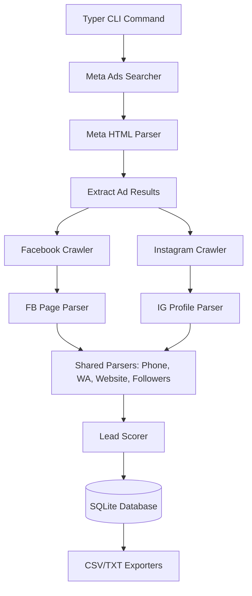

# System Architecture

LeadFinder AI follows a modular architecture, separating data models, database management, scraping logic, and parsing logic.

## High-Level Data Flow

## Core Modules

### 1. `leadfinder/models`
Contains Pydantic models for data validation and schema enforcement. 
- `BusinessLead`: Represents a final collected lead.
- `AdResult`: Represents an intermediate ad card extracted from the Meta Ads Library.

### 2. `leadfinder/database`
Handles persistence. Uses `sqlite3` to store scraped leads so that data is retained across CLI sessions. The `DatabaseManager` handles schema creation and basic CRUD.

### 3. `leadfinder/crawler`
The automation layer, powered by Playwright.
- **Meta (`crawler/meta/searcher.py`)**: Automates searching the Meta Ads Library and scrolling for ad cards.
- **Facebook (`crawler/facebook/page.py`)**: Automates visiting Facebook pages to get raw HTML.
- **Instagram (`crawler/instagram/profile.py`)**: Automates visiting Instagram profiles.

### 4. `leadfinder/parser`
Pure functions that take HTML/text and return structured data. These are fully decoupled from Playwright, making them incredibly fast and robust to unit test.
- `phone.py`: Regex and `phonenumbers` based extraction.
- `whatsapp.py`: Detection of wa.me and WhatsApp text markers.
- `website.py`: External URL validation and Facebook `l.php?u=` decoding.
- `followers.py`: Parses strings like "1.2K followers" into integers.

### 5. `leadfinder/utils/scorer.py`
The rule engine that scores leads out of 100 based on extracted data points.

### 6. `leadfinder/exporters`
Modules to dump internal dictionaries/models into external formats (CSV, TXT).
